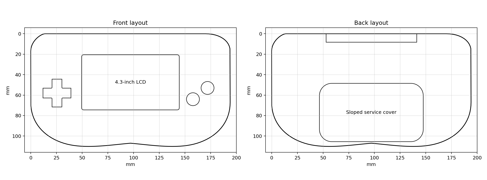

# GBA FPGA case v2

For a smaller screen and an original-sized front footprint, see the new
[compact prototype with 20K/60K SOM mounting adapters](compact/README.md).

Seven STL parts for a Tang Nano 20K, a 4.3-inch LCD and passive split GBA
button PCBs. These are the existing v2 models. On 1 October 2026 the owner
reported the larger 3D print as verified. The exact filenames and scope of
the fit check have not yet been recorded, so individual parts below remain
without a documented assembly result. Dimensions are in millimetres.
Print at 100% scale.



| Part | STL |
|---|---|
| Front shell | [Download](gba_fpga_front_shell_v2.stl) |
| Back shell | [Download](gba_fpga_back_shell_v2.stl) |
| Sloped rear module cover | [Download](gba_fpga_sloped_rear_module_cover_v2.stl) |
| LCD retainer | [Download](gba_fpga_lcd_retainer_v2.stl) |
| Nano 20K tray | [Download](gba_fpga_tang_nano_20k_tray_v2.stl) |
| Cartridge adapter tray, optional | [Download](gba_fpga_cartridge_adapter_tray_v2.stl) |
| Button PCB clamp set, eight separate clamps | [Download](gba_fpga_button_pcb_clamp_set_v2.stl) |

See the [hardware BOM](../hardware/BOM.md) for electronics and fastening
status. The cartridge tray is optional for the current USB-loaded games.

## Fit assumptions

| Parameter | Design value |
|---|---:|
| Nominal body width and height | 194 x 110 mm |
| Front/back nominal depths combined | 25 mm |
| Assumed LCD outer envelope | 105.5 x 67.2 x 3.2 mm |
| Visible LCD opening | 95 x 53.9 mm |
| Assumed Nano 20K board envelope | 76.5 x 25.5 mm |
| Assumed cartridge adapter envelope | 86 x 54 mm |
| General clearance parameter | 0.35 mm |

The curved shell's bounding height is 110.169 mm; the nominal body height
parameter does not describe every point on the outline. Measurements of the
actual panel, button PCBs, USB access and shoulder controls are still needed.
These files are not a verified drop-in replacement for an original GBA shell.

The supplied [model manifest](model_manifest.json) records geometry from the
original package. A fresh check of the exported STLs found that the front
and back shells are **not watertight**, despite that manifest reporting true.
See [export validation](stl_validation.json) for the measured results. The
other five exported models passed the watertight check. Some parts contain
multiple components, including
overlapping walls and bosses. Watertight component geometry does not prove
that they have been Boolean-unioned into one solid. Inspect the sliced layers,
connections and screw clearances before a full print. The eight disconnected
clamps in the clamp-set STL are intentional.

Start with the LCD retainer and Nano tray to check fit. The original print
profile was 0.20 mm layers, four walls, five top/bottom layers and 25-35%
infill. Treat it as a starting profile; support requirements depend on the
part orientation and slicer's treatment of overlapping components.

## Regenerate

The pinned generator environment uses Python 3.12 or newer and the packages in
[requirements.txt](requirements.txt). It uses paths relative to the script
and has no Windows-only dependency. From the repository root:

```sh
python -m venv build/cad-venv
```

On Windows:

```powershell
build/cad-venv/Scripts/python.exe -m pip install -r 3D-Case/requirements.txt
build/cad-venv/Scripts/python.exe 3D-Case/generate_gba_fpga_case.py
```

On Linux and macOS:

```sh
build/cad-venv/bin/python -m pip install -r 3D-Case/requirements.txt
build/cad-venv/bin/python 3D-Case/generate_gba_fpga_case.py
```

Edit `CaseParameters` in the [generator](generate_gba_fpga_case.py) after
measuring your hardware. Outputs go to `build/hardware/enclosure-v2/`,
including STL, OBJ, preview, geometry manifest and SHA256 checksums. Use
`--output path/to/directory` to change the destination. Regeneration does
not overwrite these checked-in STLs by default. Library versions can change
triangulation and file hashes; compare dimensions and geometry before
replacing the supplied models.

## Available versions

The local C: drive search on 1 October 2026 inspected 11,925 file paths and
1,926 archives outside system/package directories. It found this v2 set in `3D-Case`
and matching download packages. The STL-only and STL/OBJ archives contain
the same seven STL hashes. No v1 or smaller-LCD enclosure was identified
among the accessible CAD files or the scanned archives. Inaccessible paths,
offline storage and unnamed designs cannot be ruled out.

The v2 files and generator came from the existing
`GBA_FPGA_Case_v2_STL_OBJ.zip` package. The meshes remain unchanged. The
generator now writes to a separate output directory, does not replace
the repository README, and uses an explicit 2D cross product for NumPy
compatibility. The exported meshes still require the checks above.
