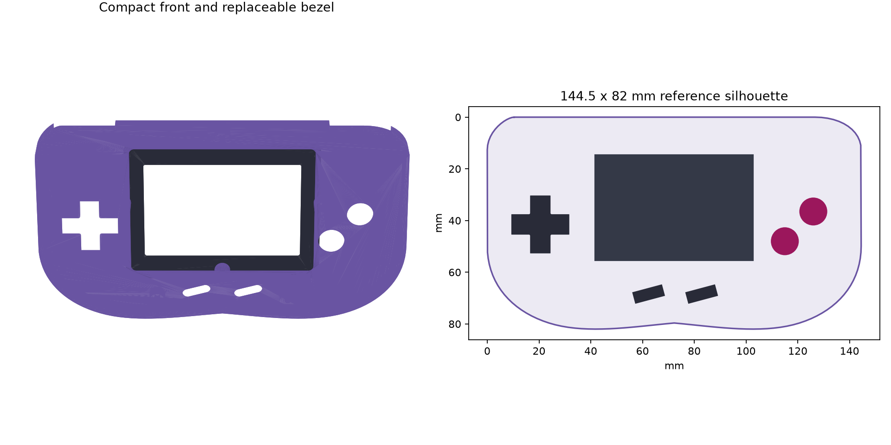

# Compact GBA-style case

A smaller-screen prototype using the original GBA's 144.5x82 mm front
footprint and 24.5 mm nominal shell depth (plus the 1 mm external bezel lip).
It keeps the horizontal grip
outline, diagonal A/B placement, D-pad, slanted Start/Select openings and
shoulder pockets. It is a new design, not a recovered v1 model or a scan of
a Nintendo shell.



Nintendo's [technical dimensions](https://www.nintendo.com/en-gb/Support/Legacy-system/Technical-data-619479.html)
provide the reference body size and 61.2x40.8 mm active display area. Control
positions, holes and clearances are design choices rather than measured
donor-shell geometry.

## Print set

| Part | Quantity | STL |
|---|---:|---|
| Front shell | 1 | [Download](compact_front_shell.stl) |
| Back shell | 1 | [Download](compact_back_shell.stl) |
| Separate display bezel | 1 | [Download](compact_display_bezel.stl) |
| LCD retainer with four mounting tabs | 1 | [Download](compact_lcd_retainer.stl) |
| Nano 20K mounting adapter | 1 if using 20K | [Download](compact_adapter_nano20k.stl) |
| Mega 60K SOM mounting adapter | 1 if using bare SOM | [Download](compact_adapter_mega60k_som.stl) |
| Eight button PCB clamps | 1 set | [Download](compact_button_pcb_clamps.stl) |
| Optional 8 mm rear spacer | 1 if needed | [Download](compact_rear_spacer_8mm.stl) |

These are **mechanical prototypes with unverified physical fit**. The LCD
model is not yet identified: the default 70x51x3.5 mm outer envelope is
provisional. The active window uses the original GBA dimensions, not a claim
that a particular off-the-shelf panel fits. There is no electrical LCD
adapter in this package. Change both active and outer panel dimensions after
measuring the selected panel; do not scale a whole STL to fit it.

## Board adapters

Both adapters use a common 102x60 mm base and a 92x50 mm four-hole mounting
pattern on the rear shell. They have corner supports, side guides and cable
tie slots rather than assuming an undocumented PCB mounting-hole pattern.
Inspect the board underside before placing it on the supports or tightening
ties. Connector, pin-header and component keep-outs have not been measured.

- **20K:** uses the existing v2 design's 76.5x25.5 mm board envelope; this
  remains an assumption pending measurement of the actual Nano board.
- **60K:** uses the bare SOM's 45x35 mm outline from
  [Sipeed's Mega 60K specifications](https://wiki.sipeed.com/hardware/en/tang/tang-mega-60k/mega-60k.html).
  The carrier and board-to-board connectors still need support and wiring.
  This adapter does **not** claim to fit a Tang Console or Mega dock board.

These parts do not adapt power, signals, connectors or FPGA designs between
20K and 60K. A bare SOM needs a carrier; the mounting cradle alone cannot run
it. Confirm which 60K board will be used before printing that adapter.

The rear spacer increases nominal shell depth to 32.5 mm while keeping the
front footprint. It can provide additional stack height, but does not make
an oversized carrier fit. The common top service opening is 30x8 mm; the
boards' connectors are not assumed to line up with it. Cable routing or a
panel extension needs to be fitted after checking the hardware.

## Assembly and fit checks

1. Measure the LCD glass, PCB, visible window, thickness and cable exit.
   Update [parameters.json](parameters.json). The default control layout
   allows at most a 72x53 mm panel envelope.
2. Print the bezel/retainer and selected board adapter first, at 100% scale.
3. Check button travel, silicone contacts and shoulder controls. The generic
   clamp set is not a measured mounting solution for the custom button PCBs;
   their mounting points and L/R actuators still need fitting.
4. Check full board/carrier height and connector access before the shells.
   A stack that exceeds the available depth requires the rear spacer or a
   changed back-depth parameter.
5. The bezel lip sits outside the front face; its seat enters the aperture.
   Four front bosses align with the retainer tabs. Use panel shims as needed;
   the panel compression and fastener lengths have not been validated.
6. Six perimeter fasteners join the shells; four attach the board adapter and
   four attach the retainer. The rear clearance holes are 2.8 mm, counterbores
   are 5.4 mm, and front/adapter pilot holes are 2.1 mm. Select and test the
   fastener type and length for the actual print material. The optional spacer
   needs longer perimeter fasteners. Do not assume insert compatibility.

The floor and wall thicknesses are 1.8 and 2.0 mm. No snap-fit, battery
compartment, audio assembly or finished cartridge slot is provided. These
can be fitted once the smaller-screen and board stack is established.

## Regeneration and validation

Use Python 3.12 or newer with [the shared requirements](../requirements.txt).
From the repository root:

```sh
python 3D-Case/compact/generate_compact_case.py
```

Run with the CAD virtual environment's Python as described in the
[v2 instructions](../README.md#regenerate). Outputs go to
`build/hardware/enclosure-compact/`, preserving the tracked models. Use
`--parameters path/to/parameters.json` and `--output path/to/directory` to
select another configuration. The preview includes an actual mesh view and
a schematic layout with illustrative controls; button caps are reused parts.

The generator performs Boolean unions and validates the **reloaded STL**
for watertightness, consistent winding, positive volume, finite vertices and
one connected component per solid. The eight independent clamp components
are intentional. All eight exported models passed. See
[model_manifest.json](model_manifest.json) for dimensions and SHA256 hashes.
The shell seam and assembled bezel were checked for positive-volume
intersections, and the adapter bosses were checked inside the rear walls.
These checks do not prove physical assembly, panel fit or printability on a
particular printer. Windows generation was tested; Linux/macOS commands use
the same portable Python code but were not run in this session.
The `case-models` CI workflow runs generation on Windows, Linux and macOS.
