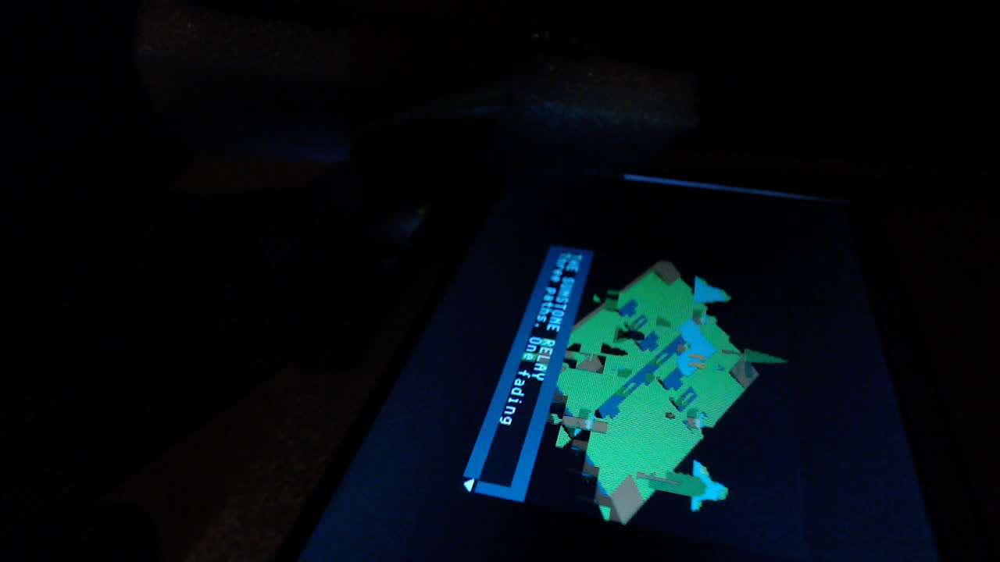
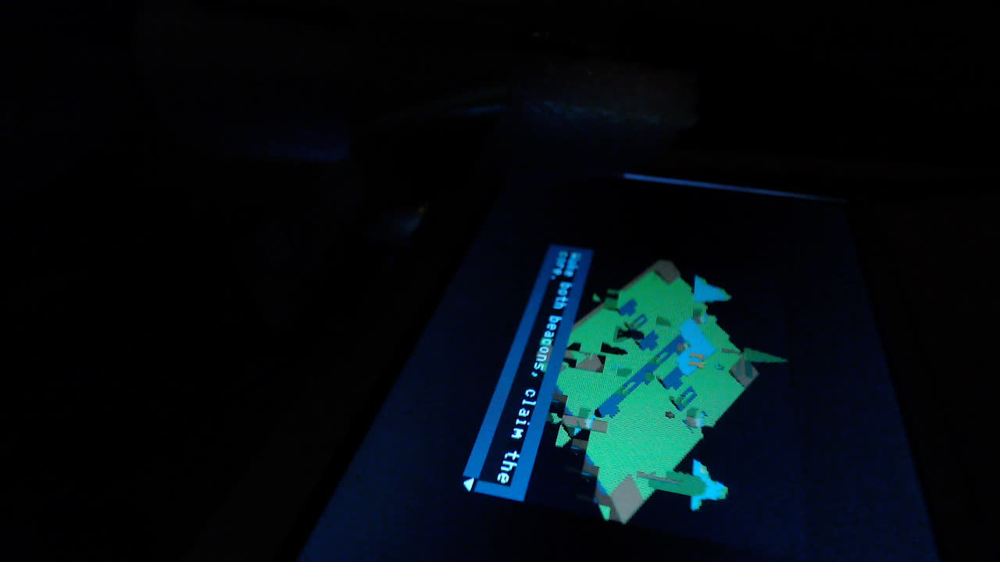

# Nano 20K LCD hardware report

Recorded on 1 October 2026 using Gowin V1.9.12.04, device
`GW2AR-LV18QN88C8/I7`, and the 480x272 RGB565 LCD.

## Findings

- The Studio platform accepts the current Sunstone Relay isometric firmware.
  Its 32,272-byte UART upload passed CRC32 (`bc6fa058`), and 145 game frames
  completed in 5.005 seconds: **28.974 fps**, with no reported CPU trap.
- Before the upload, the board returned `loaded=false`, zero bytes and zero
  frames. That explains the black display at that point: the Studio platform
  was waiting for firmware. FPGA programming or a reset requires another
  upload; the UART game image is volatile.
- The current Studio place-and-route report has zero setup and hold violations
  under its existing constraints. All 46 block RAMs and both PLLs are allocated.
- Game Boy gameplay was confirmed on this panel on 30 September. Its new build
  still has one hold violation. A working picture does not establish timing
  closure across device, voltage and temperature variation.

After the camera was repositioned, the Logitech StreamCam showed Sunstone
Relay's isometric village and opening dialogue on the LCD. A serial A press
advanced the visible dialogue. This confirms the picture and that input
response; movement and completion of the quest were not tested. The game is
240x160, centered with 120-pixel horizontal and 56-pixel vertical margins on
the 480x272 panel. The borders are intentional.





The exact programmed bitstream was not read back; UART identified the
Studio platform protocol. The hashes below identify the local build outputs,
not an independently verified JTAG readback.

## Capacity after place and route

The Game Boy report was generated at 09:48:45 and the Studio report at
09:51:19 local time. Percentages retain Gowin's rounding.

| Resource | Game Boy LCD | Studio LCD |
|---|---:|---:|
| Logic / 20,736 | 4,108 (20%) | 14,251 (69%) |
| Registers / 15,915 | 1,843 (12%) | 5,142 (33%) |
| CLS / 10,368 | 2,815 (28%) | 8,060 (78%) |
| Block RAM / 46 | 16: 8 SP + 8 SDPB (35%) | 46: 2 SP + 44 SDPB (100%) |
| DSP | No DSP usage entry | 1 MULT9X9 + 2 MULTADDALU18X18 (10%) |
| Primary clocks / 8 | 5 (63%) | 5 (63%) |
| Local clock resources (LW) / 8 | 5 (63%) | 8 (100%) |
| rPLL / 2 | 2 (100%) | 2 (100%) |
| I/O ports / 66 | 27 (41%) | 27 (41%) |

Game Boy leaves 30 block RAMs free. Studio's framebuffer uses 40 blocks;
adding a large buffer or logic-analyzer capture memory needs a new allocation
plan. Free logic alone is insufficient. The earlier isolated Studio build used
14,358 logic resources and 5,108 registers; these newer figures replace that
snapshot, rather than representing a controlled optimization comparison.

## Timing

| Post-route result | Game Boy LCD | Studio LCD |
|---|---:|---:|
| Setup violated endpoints | 0 | 0 |
| Hold violated endpoints | 1 | 0 |
| Worst listed setup slack | +4.641 ns | +10.734 ns |
| Worst listed hold slack | **-1.323 ns** | +0.329 ns |
| Paths analyzed | 9,031 | 16,267 |

Setup uses the slow 0.95 V / 85 C model; hold uses the fast 1.05 V / 0 C
model. These are timing model corners, not measured board voltages.

The Game Boy hold path runs from `n43_s2/I3` to `clk_gb_s4/D`, from the
generated `gb` clock to `main`, with -1.511 ns clock skew and 0.234 ns data
delay. It involves the fabric divider's feedback. The divider produces a
4.32 MHz clock from 21.6 MHz, and `clk_gb` uses a local clock resource. Review
the divider architecture, clock distribution and generated-clock definition
together. Do not hide the path with a false-path exception without proving
that it is functionally asynchronous or otherwise inapplicable.

| Clock | Configured MHz | GB reported Fmax MHz | Studio reported Fmax MHz |
|---|---:|---:|---:|
| Main | 21.6 | 108.153 | 50.346 |
| SDRAM | 64.8 | 197.047 | 239.509 |
| Pixel | 9.0 | 108.709 | 47.020 |
| Game Boy | 4.32 | 46.611 | N/A |

Fmax concerns analyzed setup paths. It does not resolve hold failures or
justify changing CPU, SDRAM or panel clocks. Both SDC files declare pixel
and main/memory clock groups asynchronous; zero violations do not prove CDC
correctness. The existing SDCs also lack external input/output delay budgets,
so this is not full timing sign-off for the LCD and board interfaces.

## IDE screenshots and warnings

The supplied first screenshot is the **Game Boy synthesis report**, not its
post-route timing report. It shows only part of a CPU path and a clock fanout
of 1,350; the visible arrival-time rows cannot establish final slack. Synthesis
uses 4,080 logic resources; place and route uses 4,108.

The later Design Summary screenshot identifies `studio_lcd.gprj`, top
`studio_lcd_top`, and the correct Nano 20K device. The complete synthesis logs
contain 50 Game Boy warnings and 65 Studio warnings. The first screenshot's
40-warning count reflects an earlier stage; each route log adds one PR1014.

| Warning | Determination |
|---|---|
| GB EX3791 at `gb_lcd_video.sv:44` | Unsized subtraction widens coordinates to 32 bits before assigning 8 bits. In the visible 160x144 window the offsets fit; wrapping outside the window is masked. Make the intended width explicit during cleanup. |
| Studio EX3791 at `studio_lcd_video.sv:19-20` | Unsized coordinate constants and address arithmetic are narrowed. Active offsets are 0..239 and 0..159; the largest word address is 19,199, which fits 15 bits. This is not evidence of the unloaded-firmware black screen. |
| GB EX3779 | Gowin adds missing sensitivity-list signals in upstream logic. Review simulation/synthesis agreement; do not classify every warning as harmless. |
| GB CK3000 (2) | Synthesis cannot calculate two clock relationships involving the PLL output and `clk_gb`. Correlate with the divider hold path and final constraints. |
| Studio EX3638 (2) | Bus signals are used before explicit declarations. Clean up declarations; this build still completes. |
| Studio EX3826/EX3827 | PicoRV32 `parallel_case`/`full_case` directives carry simulation/synthesis cautions. Preserve upstream provenance and review reachable states before modifying directives. |
| PR1014, both targets | Gowin warns about generic routing of `sys_clk_d`. Review clock distribution and skew despite successful bitstream generation. |

This report records the builds as generated. It does not claim that these
warnings have been fixed. Raw IDE reports remain local. The camera captures
above are published as visual evidence;
the [structured evidence](reports/nano20k-lcd-2026-10-01.json) preserves report
hashes, warning counts, clocks and paths without publishing game ROMs.

## Power

| Model estimate | Game Boy LCD | Studio LCD |
|---|---:|---:|
| Total FPGA power | 164.104 mW | 262.482 mW |
| Quiescent | 122.768 mW | 122.768 mW |
| Dynamic | 41.336 mW | 139.713 mW |

Both estimates use default IO and remaining toggle rates of 0.125, with no
VCD or SAIF activity input. The small rounding difference between Studio's
total and the sum of its components comes from Gowin's displayed precision.
The supply voltages and junction temperature in these reports are model
inputs/results. No physical voltage, current, switching waveform or complete
handheld power measurement was taken. These estimates do not establish
Poachermon-versus-isometric power consumption.

## Reproduce the isometric upload

Use the Studio branch containing commit `c20131603` and engine `bd59f49`.
From the Studio repository, with the `studio_lcd` FPGA image programmed:

```sh
python scripts/build-tang.py examples/isometric-adventure/project.gbsproj out/tang/isometric --port COM5
```

Use `/dev/ttyUSB*` on Linux or `/dev/cu.*` on macOS. Native compilation needs
LLVM and loading needs pyserial. Vendor synthesis requires Windows or Linux;
macOS can load an existing FPGA image with openFPGALoader.

The firmware tested here has SHA256
`1da774c952e49dae1fe64613ea585474fe35bae9cee89a2e77a2aeae7ef50b52`.
A later status check still reported it loaded, with no trap and approximately
29 fps. S2 is A; S1 is Start. D-pad movement currently needs serial key masks
because external passive button GPIO assignments are unfinished.

Studio's updated branch contains current main. Its 75 targeted tests, CLI
build, native exports and ARM ROM builds passed locally. The browser build,
Windows installer and test/ROM CI jobs passed. The Tang changes remain in
the open Studio, engine and FPGA pull requests.
